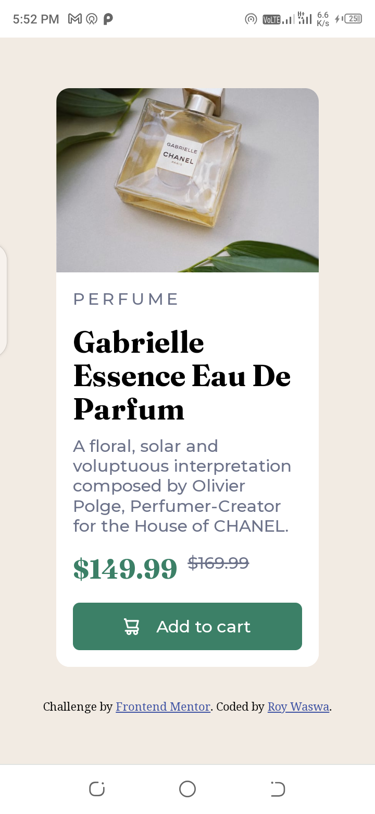

# Frontend Mentor - Product preview card component solution

This is a solution to the [Product preview card component challenge on Frontend Mentor](https://www.frontendmentor.io/challenges/product-preview-card-component-GO7UmttRfa). Frontend Mentor challenges help you improve your coding skills by building realistic projects. 

## Table of contents

- [Overview](#overview)
  - [The challenge](#the-challenge)
  - [Screenshot](#screenshot)
  - [Links](#links)
- [My process](#my-process)
  - [Built with](#built-with)
  - [Useful resources](#useful-resources)
- [Author](#author)

## Overview

### The challenge

Users should be able to:

- View the optimal layout depending on their device's screen size
- See hover and focus states for interactive elements

### Screenshot
## DESKTOP

## MOBILE

### Links

- Solution URL: [Github Repo](https://github.com/roywaswa/fem-product-preview-card)
- Live Site URL: [Live Site](https://fem-product-preview-card-smoky.vercel.app/)

## My process

### Built with

- Semantic HTML5 markup
- CSS custom properties
- Flexbox
- Sass

### Useful resources

- [Responsive Text](https://www.youtube.com/watch?v=U9VF-4euyRo) - This video by @kevin-powell is a great way to learn about responsive text.
## Author

- Frontend Mentor - [@roywaswa](https://www.frontendmentor.io/profile/roywaswa)
- Twitter - [@theroywaswa](https://www.twitter.com/theroywaswa)
- Github - [@roywaswa](https://www.github.com/roywaswa)
- LinkedIn - [@roywaswa](https://www.linkedin.com/in/roywaswa)
- Email - [roywaswa.rw@gmail.com](mailto:roywaswa.rw@gmail.com)

